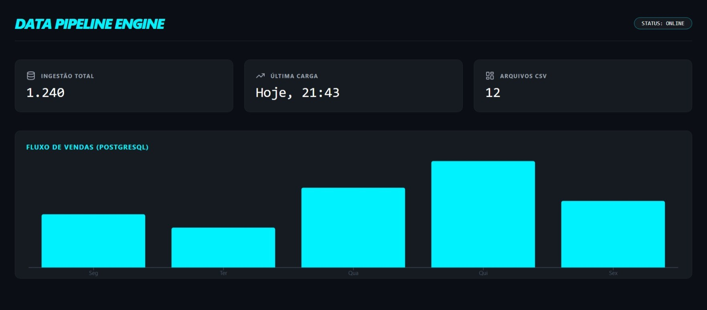

# 🚀 Sales Data Pipeline & Monitoring Engine

Este projeto simula um cenário real de **Engenharia de Dados**, onde arquivos de marketing e vendas são extraídos, tratados via **Apache Spark** e carregados de forma automatizada em um banco de dados estruturado para análise em um dashboard interativo.

## 📊 Visual do Dashboard


---

## 🛠️ Stack Tecnológica

* **Linguagem:** Python 3.11+
* **Processamento Distribuído:** Apache Spark (PySpark)
* **Manipulação de Dados:** Pandas
* **Banco de Dados:** PostgreSQL 15 (Dockerizado)
* **Conectividade:** SQLAlchemy & Psycopg2
* **Frontend:** React, Tailwind CSS e Recharts (Vite)
* **Infraestrutura:** Docker & Docker Compose

---

## 🏗️ Arquitetura do Projeto

1.  **Extração (Extract):** Leitura de arquivos `.csv` brutos nas pastas `/data/marketing` e `/data/financeiro`.
2.  **Transformação (Transform):** * **Marketing:** Cálculo de ROI, CPC (Custo por Clique) e Taxa de Conversão.
    * **Financeiro:** Cruzamento de vendas reais vs. metas mensais com status automatizado.
3.  **Carga (Load):** Ingestão automatizada dos dados limpos no PostgreSQL via Docker.
4.  **Visualização:** Dashboard React que consome as métricas de ingestão e fluxo.

---

## ⚡ Executando os Pipelines com Apache Spark

O diferencial deste projeto é a utilização do **Spark** para processamento de alto desempenho.

### 1. Análise de ROI (Marketing)
Calcula a performance das campanhas em diferentes plataformas (Google, Instagram, TikTok).
```powershell
python scripts/processar_marketing.py

